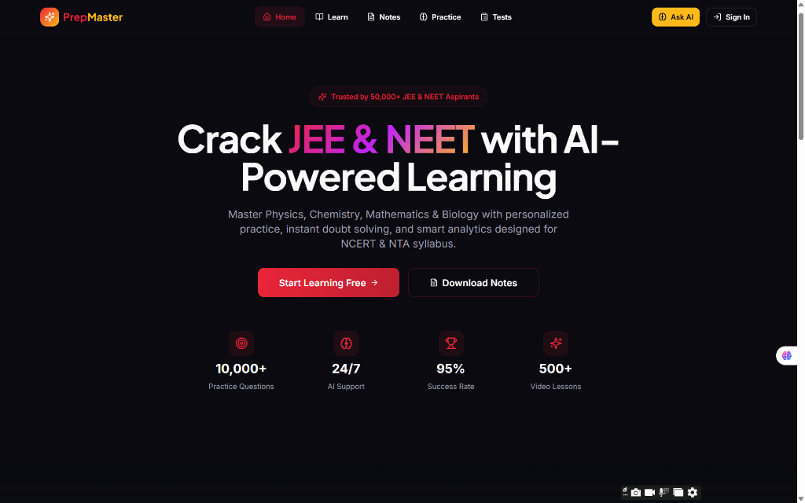

# Mohith B — Interactive 3D Portfolio & WebGL Realm

An interactive 3D WebGL personal portfolio and digital realm for **Mohith B** (Full-Stack Developer & AI/ML Engineer, Atria Institute of Technology, Bengaluru). Built using **Three.js**, **WebGL**, custom GLSL shaders, procedural asset generation, scroll-driven camera animation, and modern web APIs.



---

## ✨ Features

- **Live 3D Kyoto Mountain Temple Scene**: Built entirely runtime with Three.js — features glowing stone lanterns, Torii gate, procedural mist/fog, falling maple leaves, water reflections, and a blood moon.
- **Scroll-Driven Camera Rig**: Smoothly interpolates through 6 visual chapters as you scroll down the page.
- **3D Extruded Wordmark**: WebGL canvas glyph extrusion rendering **MOHITH** in 3D space.
- **Interactive 3D Book Library (`work.html`)**: Interactive 3D wooden shelf stage featuring 5 custom-bound 3D project field guides with realistic page turns.
- **Featured Projects**:
  - **ACE PREP**: Full-stack JEE & NEET preparation platform with student authentication & test analytics dashboard.
  - **Human Collapse Detector**: Real-time human collapse & fall detection system via OpenCV & MediaPipe Pose landmark tracking.
  - **Food Genie**: AI-powered food ordering system with Stripe payment gateway.
  - **Smart Route Buddy**: AI smart transportation & route guidance concept.
  - **Smart Volunteer System**: Community tech & volunteer coordination platform.
- **SIH 2026 Hackathon Spotlight**: Smart India Hackathon 2026 Top 10 Selection (Hardware Track: Underground Mine Safety | Software Track: AI Voice Assistant for Skilling).
- **Achievements & Certifications**: 1st Place at Unimerge Hackathon, Atria AI Club member, and 7 verified technical certifications from Google Cloud, IBM, Infosys, and Tata.
- **Resume Download**: Integrated PDF resume (`mohith-b-resume.pdf`) view & download feature.

---

## 🛠️ Stack & Technologies

- **3D Graphics**: Three.js, WebGL, Custom GLSL Shaders, Post-Processing
- **Frontend**: HTML5, CSS3, JavaScript (ES6+), Google Fonts
- **Backend / Tooling**: Node.js, HTTP Server, npm

---

## 🚀 Local Development Setup

1. **Clone the repository**:
   ```bash
   git clone https://github.com/mohithb7atria-ai/3d-Portfolio.git
   cd 3d-Portfolio
   ```

2. **Start the local server**:
   ```bash
   node server.js
   ```

3. **Open in Browser**:
   Navigate to `http://localhost:8090/portfolio.html` in your web browser.

---

## 👤 Author

**Mohith B**
- **Email**: [mohithb70@email.com](mailto:mohithb70@email.com)
- **LinkedIn**: [linkedin.com/in/mohith-b-481a82378](https://linkedin.com/in/mohith-b-481a82378)
- **GitHub**: [github.com/mohithb7atria-ai](https://github.com/mohithb7atria-ai)

© 2026 Mohith B. All rights reserved.
